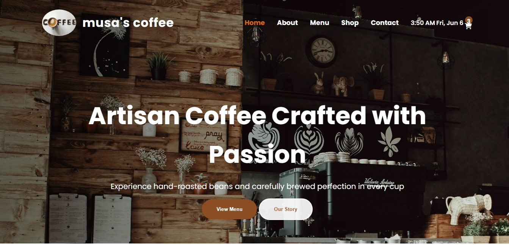
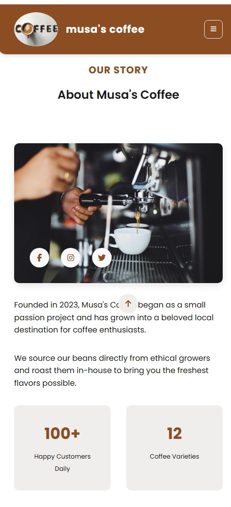
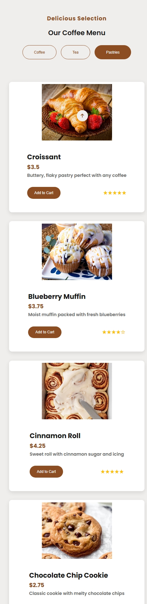
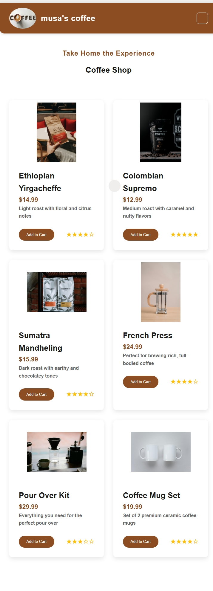
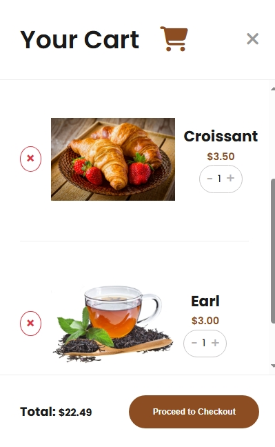

# ☕ Musa's Artisan Coffee – E-Commerce Website

A fully responsive, elegant coffee shop e-commerce website built using **HTML**, **CSS**, and **JavaScript**. This project includes dynamic features such as a shopping cart system, smooth user interaction, and a beautiful user interface inspired by artisan café aesthetics.

---

## 🔥 Features

- 🎨 Stylish modern design with a warm coffee-themed color palette  
- 🛒 Functional shopping cart (add, remove, update items)  
- 💬 Loading animation with steam effect for visual engagement  
- 📱 Fully responsive layout across desktop, tablet, and mobile  
- ⏱️ Live current time display  
- 📌 Sticky navbar with scroll behavior  
- 📊 About section with animated stats and hover effects  
- 🌐 Social media links with hover animations  
- ⚡ Smooth transitions and interactive UI  

---

## 📁 Tech Stack

| Technology | Description |
|------------|-------------|
| **HTML5**  | Page structure |
| **CSS3**   | Styling with custom variables, flexbox, and grid |
| **JavaScript** | Dynamic cart logic, animations, and interactions |

---

## 🖼️ Screenshots

> For the full set of responsive screenshots (20 total), see the [`/screenshots/`](./screen-shoot/) folder.

### 🖥️ Desktop – Header Section


### 📱 Mobile – About Section


### 📱 Mobile – About Section


### 💻 Tablet – Shop Section


### 💻 Tablet – Shop Section

---

## 🚀 Getting Started

To run this project locally:

```bash
git clone https://github.com/yourusername/coffee-shop-ecommerce.git
cd coffee-shop-ecommerce
open index.html
Or view it live here

📦 Folder Structure
coffee-shop-ecommerce/
├── css/               # CSS styles
├── js/                # JavaScript functionality
├── imgc/              # Images used in the project
├── screenshots/       # Real responsive screenshots
├── index.html         # Main entry point
└── README.md          # Project description
💡 Inspiration
This project simulates a realistic e-commerce website for a local coffee shop, designed to be extendable into a full online store. It's also a portfolio piece demonstrating web development, responsiveness, and interactive design.

📬 Contact
GitHub: 

Email: mosamlam389@gmail.com